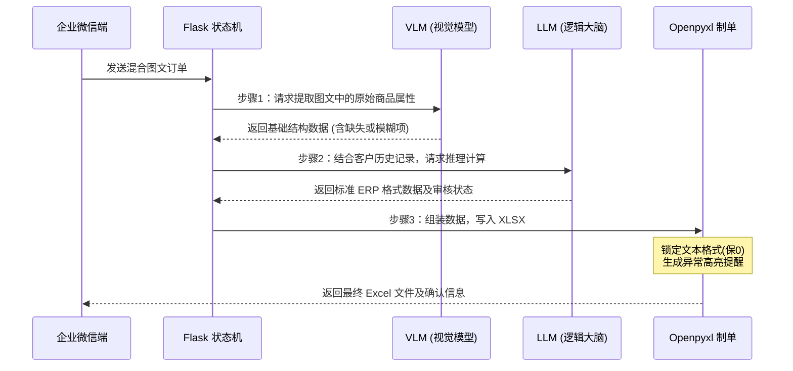

# AI-Order-Pipeline

一个基于企业微信的智能订单处理系统，通过AI大模型实现订单信息的自动识别、匹配和录入，大幅提升管家婆ERP系统的制单效率。

## 功能特性

- **智能客户匹配**：支持模糊搜索，快速匹配客户信息
- **多模态订单识别**：支持图片识别和文本解析，自动提取订单中的商品信息
- **历史记录智能匹配**：基于客户历史购买记录，准确匹配商品ID和规格
- **Excel/CSV自动生成**：自动生成符合管家婆ERP格式要求的单据文件
- **企业微信集成**：通过企业微信机器人接收订单，交互式制单流程
- **汇总与单独模式**：支持汇总单据和单独生成文件两种模式

## 系统架构

```
├── main.py                 # Flask Web服务主程序（企业微信Webhook）
├── main_order_processor.py # 订单处理核心模块（AI识别与匹配）
├── csv_generator.py        # Excel/CSV文件生成器
├── match_customer.py       # 客户模糊匹配模块
├── get_history.py          # 历史记录查询模块
├── customer_list.csv       # 客户列表数据
├── product_list.csv        # 产品历史记录数据
├── input_module.csv        # 管家婆ERP导入模板
└── generated_orders/       # 生成的单据输出目录
```

## 核心模块说明

### 1. 主程序 (main.py)

- 提供企业微信Webhook接口 (`/wechat`)
- 实现基于状态机的交互式下单流程
- 支持文本和图片消息的收集与处理
- 后台线程处理订单，避免阻塞Web服务

### 2. 订单处理器 (main_order_processor.py)

- 使用多模态AI模型识别图片中的商品信息
- 基于客户历史购买记录进行商品匹配
- 支持时间优先原则和上下文同义词匹配
- 自动处理单位换算和数量计算

### 3. 文件生成器 (csv_generator.py)

- 根据管家婆ERP模板生成Excel文件
- 自动生成单据编号（AI-YYYYMMDD-XXX格式）
- 支持汇总模式（追加到当日汇总表）和单独模式
- 正确处理客户ID等数字字段的格式

### 4. 客户匹配器 (match_customer.py)

- 基于RapidFuzz库实现模糊匹配
- 支持中文名称相似度计算
- 可配置匹配阈值

### 5. 历史记录查询 (get_history.py)

- 从产品历史记录中提取客户专属商品列表
- 按销售时间倒序排列
- 提供AI匹配所需的上下文信息

## 依赖要求

```
flask>=2.0.0
wechatpy>=1.8.18
openai>=1.0.0
pandas>=1.5.0
openpyxl>=3.0.0
rapidfuzz>=2.13.0
requests>=2.28.0
```

## 配置说明

### 1. 企业微信配置 (main.py)

```python
CORP_ID = 'your_corp_id'
CORP_SECRET = 'your_corp_secret'
AGENT_ID = 123456
TOKEN = 'your_token'
AES_KEY = 'your_aes_key'
SAVE_DIR = r"F:\aibot\downloads"  # 图片存储路径
```

### 2. AI模型配置 (main_order_processor.py)

```python
# 多模态模型（图片识别）
MULTIMODAL_API_KEY = ""
MULTIMODAL_BASE_URL = ""
MULTIMODAL_MODEL = ""

# 文本模型（订单处理）
TEXT_API_KEY = ""
TEXT_BASE_URL = ""
TEXT_MODEL = ""
```

### 3. CSV文件路径

- `customer_list.csv`: 客户列表（包含单位编号、单位全名字段）
- `product_list.csv`: 产品历史记录（包含商品编号、商品全名、规格、计量单位、最近销售时间等字段）
- `input_module.csv`: 管家婆ERP导入模板（标准表头格式）

## 使用流程

### 1. 启动服务

```bash
python main.py
```

服务启动后监听 5000 端口

### 2. 企业微信交互流程

用户在企业微信中按以下步骤操作：

**Step 0**: 发送 `下单` 命令

```
用户: 下单
系统: 请按以下模板发送信息：
     客户名称，录单日期，是否汇总
```

**Step 1**: 提交客户信息

```
用户: 采桑庄，今天，是
系统: ✅ 已锁定：【采桑庄XX店】
     📅 录单日期：2026-03-02
     📝 汇总方式：追加至汇总表
     请发送【订单内容】(可连续发送多张图片/多段文字)
     ⚠️ 下单完成后请回复【确认下单】。
```

**Step 2**: 发送订单内容

```
用户: [发送多张图片/文本]
系统: 📥 已收集 N 条内容。请继续发送，或回复【确认下单】。
```

**Step 3**: 确认下单

```
用户: 确认下单
系统: ✅ 制单完成！
```

**取消操作**: 任何步骤发送 `取消下单` 即可终止流程

### 3. 输出文件

生成的文件保存在 `generated_orders/` 目录：

- 汇总模式：`YYYY-MM-DD汇总单据.xlsx`
- 单独模式：`AI-YYYYMMDD-XXX客户名称.xlsx`

## 命令行测试

### 测试客户匹配

```bash
python match_customer.py "采桑"
```

返回JSON格式的匹配结果。

### 测试历史记录查询

```bash
python get_history.py "0101006"
```

返回该客户的历史商品列表。

## 数据文件格式

### customer_list.csv

```csv
单位编号,单位全名
0101006,采桑庄XX店
```

### product_list.csv

```csv
单位编号,单位全名,商品编号,商品全名,规格,计量单位,辅助单位,最近销售时间
0101006,采桑庄XX店,0101325,可口可乐,500ml,瓶,1箱=24瓶,2026-02-28
```

### input_module.csv

标准管家婆ERP导入模板，包含表头和表体数据结构。

## 技术亮点

1. **多模态AI融合**: 结合图片识别和文本理解，提升订单解析准确率
2. **智能上下文匹配**: 基于历史购买记录，支持模糊商品名称和单位匹配
3. **状态机交互**: 清晰的用户交互流程，支持取消和重试
4. **异步处理**: 后台线程处理AI任务，Web服务不阻塞
5. **编码兼容**: 支持UTF-8和GBK编码，兼容不同数据源
6. **格式保护**: Excel生成时正确处理数字ID的文本格式

## 注意事项

1. **API密钥安全**: 请妥善保管企业微信和AI模型的API密钥
2. **文件编码**: CSV文件建议使用UTF-8编码，GBK作为备选
3. **网络要求**: 需要稳定的网络连接访问企业微信API和AI模型API
4. **数据备份**: 定期备份 `generated_orders/` 目录中的生成文件
5. **匹配阈值**: 根据实际业务调整客户匹配的置信度阈值（默认55）

## 流程图

