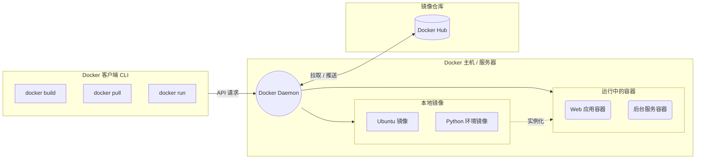

## 1. 介绍

- Docker 通过将应用程序及其所有依赖项（代码、运行环境、系统库等）打包成一个标准化的单元（也就是**容器**），实现了“一次封装，到处运行”。无论是在你的本地开发机、Ubuntu 服务器，还是云端环境中，应用都能以相同的方式运行，彻底解决了“在我的机器上明明是可以运行的”这种经典的环境配置问题。参考以下 Docker 架构图：



## 2. Docker 的三大核心概念

1. **镜像 (Image):** 相当于操作系统的安装光盘或是面向对象编程中的“类”。它是一个只读的模板，包含了运行应用所需的全部环境和代码。
2. **容器 (Container):** 镜像是静态的，容器则是镜像运行时的实体。可以把它看作是一个轻量级、独立运行的微型 Linux 系统。容器之间相互隔离，互不影响。
3. **仓库 (Registry):** 用来集中存储和分发镜像的地方。最著名的是官方的 Docker Hub，你可以在上面找到各种软件的官方镜像（如 Nginx、Python、MySQL 等）。

---

## 3. Docker 安装

- 在Windows上可以安装Docker-desktop客户端，会提供GUI，Windows终端也可用，但资源消耗较高。
- 也可以在WSL2上的linux系统中安装原生Docker，两者都是跑在WSL2 Linux内核上的，更建议此方法。（有时会遇到 WSL IP 变动导致无法直接通过 `localhost` 访问的情况）
- Linux 安装命令：
```bash
# 更新软件源
sudo apt update && sudo apt upgrade -y

# 使用官方脚本一键安装 Docker 和 Docker Compose
curl -fsSL https://get.docker.com | bash

# 安装验证
docker compose version
docker -v
```

## 4. Docker 基础操作指南

在日常的服务器管理和应用部署中，以下是最常用的基础命令：
#### 1. 镜像管理

```bash
docker pull ubuntu:22.04
```
#### 2. 容器生命周期管理

```bash
docker run -d --name my_app -p 8080:80 nginx
```
#### 3. 运维与调试

```bash
docker logs -f my_app
```

---
## 5. Docker 应用实战指南：容器化一个 Web 应用

假设你正在开发一个基于 Python (Flask) 的 Web 项目，并需要将其打包部署。以下是典型的 Docker 化流程：

- **第一步：编写 Dockerfile**
在你的项目根目录下创建一个名为 `Dockerfile`（无后缀）的文件。它就是构建镜像的自动化脚本：
```dockerfile
# 1. 指定基础镜像（这里使用轻量级的 Python 3.10 环境）
FROM python:3.10-slim

# 2. 设置容器内的工作目录
WORKDIR /app

# 3. 将本地的依赖清单复制到容器中
COPY requirements.txt .

# 4. 安装 Python 依赖（例如 Flask, Pandas, Openpyxl 等）
RUN pip install --no-cache-dir -r requirements.txt

# 5. 将当前目录下的所有项目代码复制到容器的 /app 目录
COPY . .

# 6. 声明容器运行时监听的端口
EXPOSE 5000

# 7. 指定容器启动时执行的命令
CMD ["python", "app.py"]

```

- **第二步：构建镜像**
在包含 `Dockerfile` 的目录下执行以下命令，将你的代码和环境打包成一个新的镜像：
```bash
docker build -t my-flask-project:v1 .
```
- **第三步：运行容器**
镜像构建完成后，就可以将其作为容器启动：
```bash
docker run -d --name web_service -p 5000:5000 my-flask-project:v1
```
现在，你的应用就已经在一个独立的 Docker 容器中安稳地运行了。

## 6. Docker容器移植

以Docker-desktop上的容器移植到Ubuntu为例。
### 1. 备份打包数据
- 打开 Windows 的 Docker Desktop，找到正在运行的容器，查看 "Inspect" -> "Mounts"。
- 找到 `Source`（你的 Windows 本地路径）和 `Destination`,记下这个 **Windows 本地路径**。
- 停止容器，找到本地路径下的文件并打包复制。
### 2. 文件上传
- 使用带有 SFTP 功能的 SSH 终端。
- 在 Ubuntu 上创建一个目录，如 `/root/app`
- 上传压缩包并解压：
```bash
# 创建目录
mkdir -p /root/app/data

# 如果是 zip
apt install unzip -y
unzip data.zip -d /root/app/data

# 确认文件结构：确保 /root/app/data 里面直接是你的配置文件，而不是又套了一层文件夹
ls /root/app/data
```

### 3. 启动容器

- 推荐使用 `docker-compose` 来管理，比直接敲很长的 `docker run` 命令更方便维护。
- 创建配置文件，在`/root/app` 目录下创建一个名为 `docker-compose.yml` 的文件：
```bash
nano /root/astrbot/docker-compose.yml
```
- 根据容器信息填写YAML文件
- 按 `Ctrl + O` 保存，按 `Enter` 确认，按 `Ctrl + X` 退出编辑器。
```yaml
version: '3'

services:
  app:
    image:   # 确保这里与你Windows上使用的镜像一致
    container_name: app
    restart: always
    network_mode: host  # 推荐使用 host 模式，网络连接更通畅
    volumes:
      - ./data:/app/data  # 将刚才解压的目录映射进去
```
- 修复权限：有时候 Windows 和 Linux 的文件权限不一致会导致启动失败。
```bash
chmod -R 755 /root/app/data
```
- 启动容器：
```bash
cd /root/app
docker compose up -d
```