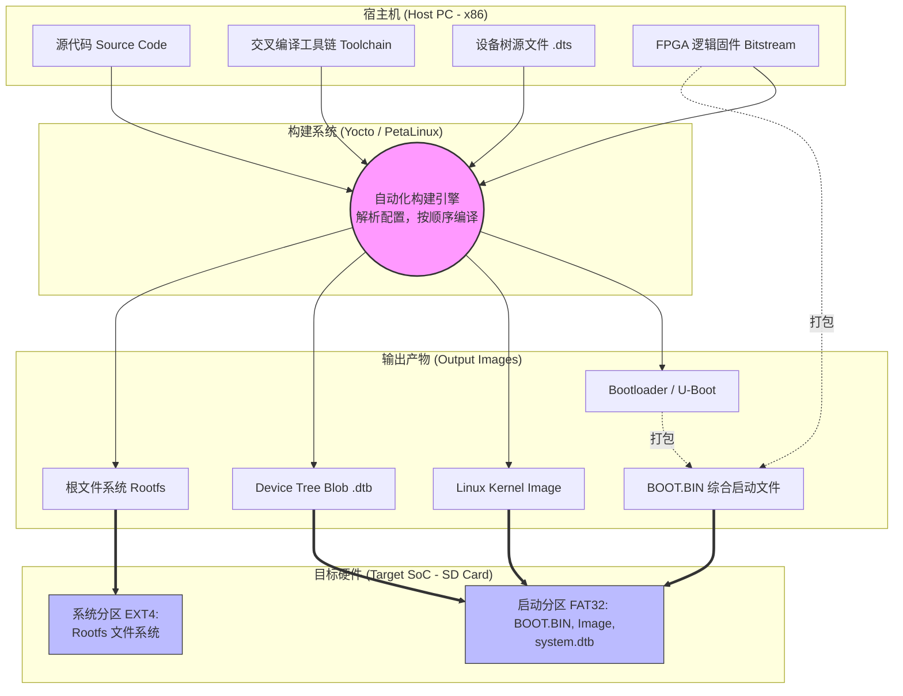
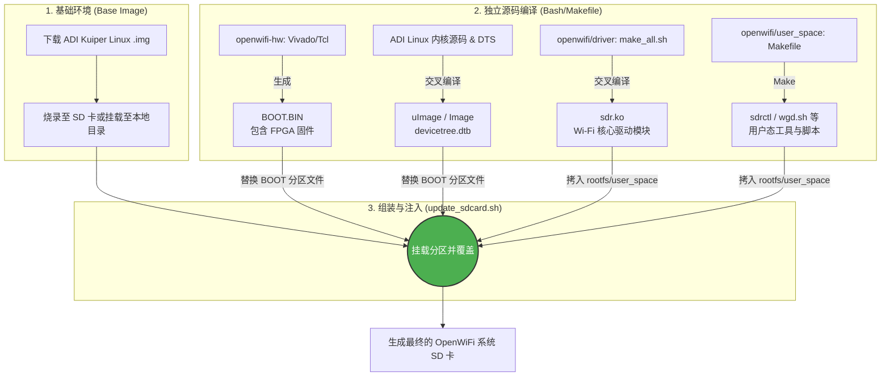

# 1. 核心概念

## 1. 交叉编译 (Cross-Compilation)

由于 ARM 芯片（目标板）的算力和存储有限，我们无法直接在上面运行庞大的编译器去编译 Linux 内核。因此，我们需要在性能强大的 x86 电脑（宿主机）上，使用一套特殊的编译器（交叉编译工具链），生成能够在 ARM 架构上运行的二进制代码。

## 2. 嵌入式系统的“四大金刚”

任何一个跑着 Linux 的嵌入式板子（比如 OpenWiFi 的硬件），它的 SD 卡或闪存里都必须包含以下四个核心部件。这也是构建系统最终要生成的产物：

- **Bootloader (如 U-Boot):** 它是系统上电后运行的第一段代码。它的任务是初始化内存，并且把 Linux 内核从 SD 卡搬运到内存中去运行。
    
- **Linux Kernel (内核 Image):** 操作系统的核心。在构建时，你需要通过配置文件（`.config`）裁剪掉不需要的功能（比如鼠标键盘驱动），保留 OpenWiFi 需要的无线协议栈和网络功能。
    
- **设备树 (Device Tree, DTB):** 这是嵌入式 Linux 中极其重要的一环。它是一个描述硬件“长什么样”的数据结构文件。对于 OpenWiFi 来说，ARM 需要通过设备树知道：FPGA 上的物理寄存器映射在哪个内存地址？中断号是多少？
    
- **根文件系统 (Rootfs):** 包含了系统启动后需要的目录结构（如 `/bin`, `/etc`, `/lib`）以及用户态程序。OpenWiFi 的控制脚本和底层库就存放在这里。

## 3. 构建工具与流程

手动去编译上述的四个部分非常痛苦且容易出错。因此，业界开发了自动化构建系统。通常会使用 **Yocto Project** 或 Xilinx 官方基于 Yocto 包装的 **PetaLinux**。

这些构建系统就像是“全自动组装流水线”，你只需要提供原材料（源码）和图纸（配置文件），它就能帮你吐出最终可以烧录到 SD 卡里的镜像文件。

## 2. Openwifi 的构建简介

OpenWiFi 走的是一条更轻量、更底层的**“基础镜像 + 脚本覆盖 (Overlay)”**路线。

它极度依赖 Analog Devices (ADI) 提供的预编译发行版，然后通过一系列 Bash 脚本和 Makefile 将自己编译的组件强行“注入”到系统中。

以下是 OpenWiFi 真实的构建架构与逻辑拆解：

### 1. 基于 ADI Kuiper Linux

OpenWiFi 并不从零编译整个根文件系统（Rootfs），而是直接下载 ADI 官方维护的 **Kuiper Linux**（基于 Debian/Raspbian 的轻量级系统）的现成 `.img` 镜像。
开发者只需要交叉编译 OpenWiFi 特有的核心部件，然后用新部件替换掉原镜像中的旧部件。

### 2. 构建与替换流程

根据仓库中的文档（如 `doc/img_build_instruction/kuiper.md`）和脚本，整个构建过程分为以下几个独立操作：

- **FPGA 逻辑 (BOOT.BIN):** 在 `openwifi-hw` 仓库中，通过运行 Tcl 脚本和 Vivado 导出包含底层物理层逻辑的 FPGA 固件。
- **内核与设备树 (Kernel & DTB):** 使用标准的 Linux 内核源码编译出 `uImage` (32位) 或 `Image` (64位)，并通过 `dtc` 工具将 `devicetree.dts` 编译为 `.dtb` 文件。
- **核心驱动 (sdr.ko):** 依靠 `driver/make_all.sh` 脚本，将 OpenWiFi 的核心软 MAC 驱动进行树外（out-of-tree）交叉编译，生成内核模块。
- **用户态工具 (sdrctl等):** 简单的 Makefile 编译，生成用于用户态和内核态通信的控制工具。

### 3. OpenWiFi 镜像构建流水线

