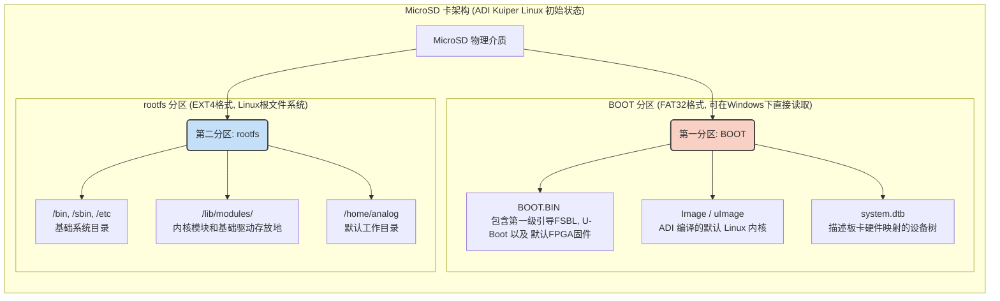
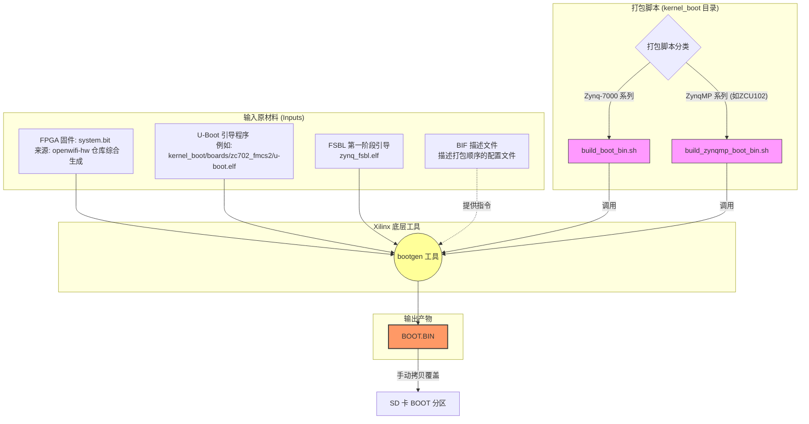
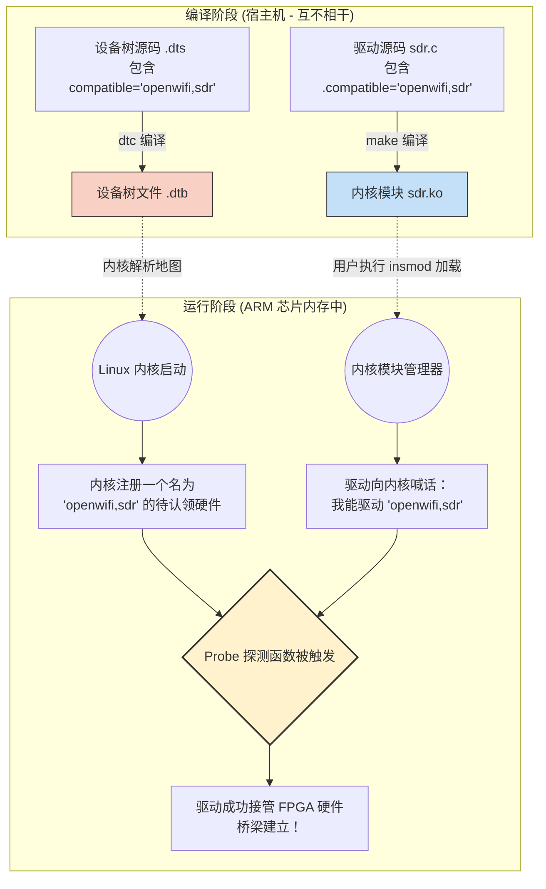
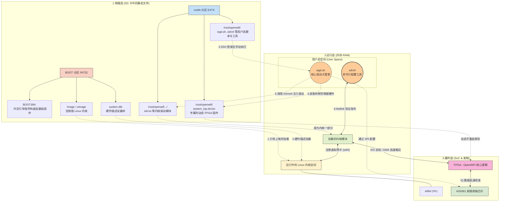

## 第一步：准备与剖析基础操作系统 (ADI Kuiper Linux)

Openwifi 并没有选择原生的 Ubuntu 或纯净的 Debian，而是严格依赖 Analog Devices (ADI) 官方维护的 **Kuiper Linux**。

核心原因在于，Openwifi 的硬件平台极度依赖 ADI 生产的射频收发器（如 SDR 板卡上的 AD9361）。Kuiper Linux 内部已经深度集成了这些射频芯片的底层驱动、IIO (Industrial I/O) 子系统框架以及 `libiio` 库。
### 1. 操作

- **获取镜像:** 根据 Openwifi 官方文档的版本要求，从 ADI 官方源下载特定版本的 Kuiper Linux 预编译镜像（通常是一个庞大的 `.img.xz` 压缩包）。
    
- **物理烧录:** 解压后，使用诸如 `dd` 命令（Linux环境）或 BalenaEtcher（跨平台图形工具），将 `.img` 文件以逐扇区拷贝的方式写入一张 MicroSD 卡中。
### 2. 镜像结构

从 ADI 官方获取并烧录到 SD 卡里的那个 `.img` 文件（例如 `adi-kuiper-image.img`），**不仅仅**是一个内核镜像，而是一个**完整的磁盘镜像 (Full Disk Image)**。

1. 物理分区表 (Partition Table)
- 这个 `.img` 文件自带了分区信息。烧录完成后，它会自动把你的 SD 卡切分成我们在上一步提到的两个区：一个 FAT32 格式的 `BOOT` 启动分区，和一个 EXT4 格式的 `rootfs` 系统分区。

2. 引导与底层固件 (存放在 BOOT 分区)
- 这里面包含的是系统上电后最先执行的代码：
- **BOOT.BIN:** 这是一个综合文件，里面打包了第一阶段启动加载器 (FSBL)、U-Boot（类似于你电脑的 BIOS/UEFI），以及 **ADI 默认的 FPGA 逻辑固件**。

3. 内核镜像与设备树 (存放在 BOOT 分区)
- **Kernel Image:** 通常命名为 `Image`（64位）或 `zImage`/`uImage`（32位）。这是 Linux 操作系统的核心本体。
- **Device Tree (.dtb):** 描述当前硬件拓扑结构的文件。

 4. 完整的根文件系统 (存放在 rootfs 分区)

- 所有的系统命令（`ls`, `cd`, `apt-get` 等）。
- 网络服务（如 SSH 服务器，让你能远程登录板子）。
- **ADI 预装的核心库：** 比如 `libiio`（用于控制射频芯片的工业 I/O 库）和各种测试工具。Openwifi 极度依赖这些现成的库来驱动底层的无线电前端。

5. 注意
- **Disk Image (磁盘镜像):** 后缀通常是 `.img`。指的是包含分区表、Bootloader、内核和文件系统的**集合体**。第一步烧录的就是它。
- **Kernel Image (内核镜像):** 通常叫 `Image` 或 `uImage`。它仅仅是 Linux 内核编译出来的那个**单一文件**，只是磁盘镜像中的一个组件。
- 这一步的作用是提供预装好 `libiio` 和各种底层射频驱动的操作系统环境，它是后续所有脚本运行的“宿主”。
### 3. SD 卡的分区拓扑

烧录完成后的 SD 卡不仅包含了系统文件，它的物理分区结构决定了我们后续“注入” Openwifi 组件时的目标路径。这张卡会被划分为两个核心分区：

### 4. 这一步完成后的系统状态

此时，如果你将这张 SD 卡插入 Zynq 开发板（如 zcu102 或 zedboard）并上电，系统能够顺利启动并进入 Linux 登录界面（默认账号通常是 `analog`）。
它的 FPGA 里面运行的是 ADI 默认的射频测试逻辑，内核也是标准的通用内核，没有任何 Wi-Fi 协议栈的特殊修改。

### 5. 启动链路

1. SoC ROM → 从 SD 卡 BOOT 分区加载 `BOOT.BIN`（里有 FSBL + FPGA bit + u‑boot）。
2. FSBL → 初始化 DDR、加载 FPGA 比特流、跳转到 u‑boot。
3. u‑boot → 从 BOOT 分区读取 `Image`/`uImage` 和对应 `devicetree.dtb`，然后 `bootm` / `booti` 启动 Linux 内核。

---

## 第二步：构建并替换底层硬件逻辑 (生成 BOOT.BIN)

如果说第一步准备的 SD 卡是给 ARM CPU 准备的操作系统，那么这一步我们要做的，就是给 FPGA 准备“硬件图纸”。这个图纸在 Openwifi 项目中最终被打包进一个极其重要的文件：`BOOT.BIN`。

### 1. `openwifi-hw` 仓库

Openwifi 将硬件设计和软件驱动分成了两个仓库。这一步的工作全部在 `open-sdr/openwifi-hw` 仓库中进行。你需要一台安装了庞大 EDA 工具（**Xilinx Vivado**）的强力宿主机（通常是内存至少 32GB 的工作站）。

### 2. 底层构建逻辑图

在 `openwifi-hw` 中，硬件构建并非靠鼠标在界面上拖拽连线，而是高度脚本化的。以下是源码变成 `BOOT.BIN` 的完整流程：

### 3. 详细步骤拆解

- **第一阶段：跑 Tcl 脚本 (生成比特流)**
	
	Openwifi 适配了非常多的板卡组合（比如 ZCU102 + FMCOMMS2 射频板，或者集成的 ANTSDR）。你需要在终端中调用 Vivado 并运行对应的 `.tcl` 脚本。
	
	这个脚本会自动拉取 ADI 的基础硬件设计，然后把 Openwifi 自己写的 Wi-Fi 物理层（PHY）和底层 MAC 逻辑以 IP 核的形式“拼接”进去。经过漫长的综合（将代码变成逻辑门）和布线（在 FPGA 硅片上连线）后，生成一个 `system.bit`（比特流文件）。
- **第二阶段：生成硬件描述 (XSA/HDF)**
	
	除了比特流，Vivado 还会吐出一个 `.xsa`（或早期版本的 `.hdf`）文件。这是一个极其关键的字典文件。它记录了：你刚才生成的 Openwifi 硬件，被挂载在了 ARM CPU 的哪些物理内存地址上？对应的中断号是多少？**这个文件是下一步生成 Linux“设备树”的唯一依据。**
- **第三阶段：打包 BOOT.BIN**
	
	有了 `.bit` 文件，FPGA 就能工作了，但我们还要让 ARM CPU 也能启动。所以需要用 Xilinx 的 `bootgen` 工具，把 FSBL（初始化内存和时钟的代码）、比特流文件（`.bit`）和U-Boot 缝合在一起，生成最终的 `BOOT.BIN`。
- **第四阶段：替换**
	
	将这个新鲜出炉的 `BOOT.BIN` 复制到我们在第一步准备好的 SD 卡的 `BOOT` 分区，覆盖掉 ADI 官方的那个默认文件。

### 4.具体操作

- **输入文件矩阵 (`kernel_boot/boards/`)：** 
	
	如果你仔细查看仓库的 `kernel_boot/boards/` 目录，会发现它为不同的开发板（如 `adrv9361z7035`, `antsdr`, `zc702_fmcs2` 等）准备了独立的文件夹。里面存放了已经预编译好的 `u-boot.elf`。你不需要自己去交叉编译 U-Boot。
	
- **打包脚本 (`kernel_boot/build_boot_bin.sh` 等)：** 
	
	当你准备好 Openwifi 专属的 `.bit` 文件后，只需在宿主机（需安装 Xilinx 命令行环境）运行这个脚本。 对于早期的 Zynq-7000 板子（如 ZedBoard），运行 `build_boot_bin.sh`。对于更强的 ZynqMP（如 ZCU102），则运行对应的 `build_zynqmp_boot_bin.sh`。
	
- **BIF 文件 (`user_space/system_top.bif`)：**
	
	脚本内部会使用或动态生成一个 `.bif` (Boot Image Format) 文件。这个文件相当于一份“包装清单”，告诉 `bootgen` 工具：“请先放 FSBL，接着放 FPGA `.bit` 文件，最后放 `u-boot.elf`，把它们揉成一个 `BOOT.BIN`”。
	
- **FSBL：** 
	
	通过硬件描述文件.xsa/ .hdf（与比特流文件一同由hw部分生成）动态生成，在嵌入式开发中，每一块板子的硬件连线、内存类型都不同，因此 FSBL 不能是一个通用的预编译文件，必须根据你的具体硬件去定制。

## 第三步：交叉编译定制版 Linux 内核 (Kernel)

当你运行 `user_space/prepare_kernel.sh` 时，脚本会严格按照以下顺序执行：

#### 1. 确定架构并拉取特定内核源码

脚本首先会根据你传入的参数（`32` 位或 `64` 位）决定编译策略：

- **64位 (如 ZCU102)：** 架构设为 `arm64`，使用交叉编译器 `aarch64-linux-gnu-`，目标产物是 `Image`，配置文件为 `kernel_boot/kernel_config_zynqmp`。
    
- **32位 (如 ZedBoard)：** 架构设为 `arm`，交叉编译器 `arm-linux-gnueabihf-`，目标产物是 `uImage`，配置文件为 `kernel_boot/kernel_config`。

紧接着，它会通过 `git submodule` 去拉取 ADI 官方维护的 Linux 内核源码（`adi-linux` 或 `adi-linux-64`），并硬性回退到一个非常稳定的历史提交版本（如 `c2f371e...`）以保证兼容性。

#### 2. 注入“灵魂补丁” (Applying Patches)

这是整个内核编译中最关键的一环！原生的 ADI 内核是通用 SDR 固件，缺乏 Openwifi 驱动必须的底层接口。因此，脚本会使用 `git apply` 命令，强行打入 `kernel_boot` 目录下的 4 个重要补丁。

根据 `kernel_patch_readme.md` 的记录，这些补丁的作用极其硬核：

- **`ad9361.patch`**：暴露 AD9361 射频芯片的一些底层 API 给 Openwifi 驱动使用，并添加了自动增益控制 (AGC) 设置相关的寄存器写入功能。
    
- **`ad9361_private.patch`**：为缺失的 AGC 设置补充布尔值定义。
    
- **`ad9361_conv.patch`**：这是一个硬件“续命”补丁。由于某些低端或体质较差的硬件在 61.44Msps 的高采样率下进行 LVDS 接口自校准非常困难，这个补丁可以绕过/避免这些严苛的时序自校准校准。
    
- **`axi_hdmi_crtc.patch`**：修复在开启了 Xilinx AXI DMA 功能后导致的 HDMI 显示驱动编译报错问题。

#### 3. 加载定制配置并开始编译

打完补丁后，脚本会将 Openwifi 预先调优好的 `.config` 配置文件（如 `kernel_config_zynqmp`）复制到内核源码根目录。这份配置裁剪掉了不必要的冗余驱动，并强制开启了 Openwifi 强依赖的内核选项（例如 `mac80211` 框架、UIO 支持、特定的 DMA 驱动等）。

最后，脚本调用 `make -j12` 满负载进行交叉编译，生成最终的内核镜像文件（`Image` 或 `uImage`）以及内核模块（`make modules`）。

---

## 关于设备树 (Device Tree / .dtb) 的补充

#### 1. 设备树 (Device Tree, .dtb) 到底是什么？

**一句话解释：它是 Linux 内核的“硬件说明书”。**

在你的个人电脑（x86 架构）上，插上一块独立显卡或 USB 鼠标，Windows/Linux 能自动“发现”它，因为 PCIe 和 USB 总线天生具备**热插拔和硬件发现机制**。 但在 ARM 嵌入式系统（如 Zynq 芯片）中，很多外设（包括我们的 OpenWiFi FPGA 逻辑）是直接硬连线死死挂在 CPU 的物理内存地址上的。CPU 无法自动探测地址 `0x40000000` 处究竟是挂了一个串口、一个以太网口，还是 OpenWiFi 的基带模块。

**设备树的作用就是明确告诉内核：**

- “在物理地址 `0x43000000` 到 `0x4300FFFF` 的位置，有一块 OpenWiFi 的发送通道硬件。”
    
- “如果这个硬件发出中断信号，它的中断号是 `89`。”
    
- “请使用名为 `openofdm_tx` 的驱动程序来管理这个硬件。”

内核在启动时会解析这个 `.dtb` 文件，然后根据这份清单去内存里挨个唤醒硬件并匹配驱动。

#### 2. 设备树的编译

在标准的 Linux 内核编译中，通常会一并执行 `make dtbs`。但在 Openwifi 项目中，你会在 `kernel_boot/boards/` 目录下发现，项目作者已经非常贴心地为各种主流开发板（如 `zcu102_fmcs2`, `zed_fmcs2`, `antsdr`）**提前编译并放置好了对应的 `devicetree.dtb` 或 `system.dtb` 文件**。

开发者在后续的打包和替换阶段（例如执行 `update_sdcard.sh` 时），只需要直接把这些现成的 `.dtb` 拷进 SD 卡的 BOOT 分区即可，无需在这一步重复编译。

---

## 第四步：编译核心驱动模块 (Driver Compilation)

当你执行 `./make_all.sh <XILINX_DIR> <ARCH>` 时，这个脚本启动了一条精密的流水线：

#### 1. 动态生成配置头文件 (预处理注入)

在真正调用编译器之前，脚本非常聪明地做了一件动态配置的事情：

- **生成 `pre_def.h`:** 它首先创建了这个头文件，并强制写入了 `#define USE_NEW_RX_INTERRUPT 1`。而且，它允许你通过脚本传递最多5个额外的参数（如 `$3` 到 `$7`），把它们全部转换为 `#define` 宏注入到 C 代码中。这使得开发者在不修改 C 源码的情况下，就能通过脚本开关各种底层驱动特性。
    
- **生成 `git_rev.h`:** 脚本会调用 `git log -1` 抓取当前代码仓库的最新 Commit Hash，并写入这个头文件。这样，当驱动在内核中跑起来并打印日志时，你就能精确知道当前加载的是哪个版本的代码。

#### 2. 绑定内核大树 (`KDIR`)

树外模块编译有一个铁律：**它必须依赖一个已经配置并部分编译过的 Linux 内核源码树。**

脚本会根据你选择的 32位 还是 64位 架构，将变量 `LINUX_KERNEL_SRC_DIR` 严格指向我们在第三步中准备好的 `adi-linux` 或 `adi-linux-64` 目录。

在随后的所有 `make` 命令中，它都会通过参数 `KDIR=$LINUX_KERNEL_SRC_DIR` 告诉编译器：“去那里寻找 Linux 的头文件和符号表”。

#### 3. 分块编译子模块 (Sub-modules)

OpenWiFi 的驱动并不是一个单一的 C 文件，它被模块化成了多个专注于不同任务的组件。脚本会依次进入以下目录进行独立编译：

- **`openofdm_tx` / `openofdm_rx`:** 顾名思义，这是负责与 FPGA 中 OFDM 基带发射和接收模块进行交互的控制层。
    
- **`tx_intf` / `rx_intf`:** 接口层（Interface）。它们负责管理 DMA（直接内存访问），在 ARM 内存和 FPGA 之间高速搬运真实的 Wi-Fi 数据包（IQ 数据或解调后的 MAC 帧）。
    
- **`xpu`:** 协处理器相关的驱动模块。
    
- **`side_ch`:** 边带通道（Side Channel），通常用于获取 CSI（信道状态信息）或底层的物理层调试数据。它甚至调用了一个自己专属的 `./make_driver.sh` 脚本。

#### 4. 最终的总装 (`sdr.ko`)

等所有的子目录都编译完毕后，脚本会退回到 `driver/` 根目录，执行最后一次 `make`。

这时，你上传的 `driver/Makefile` 就登场了。它非常简洁，核心只有一句：

`obj-m += sdr.o openofdm_rx/openofdm_rx.o openofdm_tx/openofdm_tx.o tx_intf/tx_intf.o rx_intf/rx_intf.o xpu/xpu.o`

这行代码指示 Linux 内核的构建系统（Kbuild），将刚才编译出的各个组件以及主入口文件 `sdr.c`，链接成最终的内核可加载模块（Loadable Kernel Modules, LKMs）。

#### 5. 概念补充

1. 什么是“内核源码树” (Kernel Source Tree)？

**简单来说，它就是 Linux 操作系统的“全部源代码文件夹”。**

因为 Linux 内核的代码量极其庞大（几千万行 C 语言代码），它被分门别类地组织在一个非常深的、像树枝一样展开的目录结构中。比如：

- `arch/`：存放不同 CPU 架构（ARM, x86, MIPS）的基础底层代码。
- `drivers/`：存放全天下所有开源硬件的驱动（网卡、显卡、USB）。
- `include/`：存放所有的**头文件 (.h)**，这里面定义了 Linux 内核世界里的各种“数据结构标准”。
- `net/`：存放网络协议栈（TCP/IP, mac80211）的核心代码。

**为什么编译驱动 (`sdr.ko`) 需要绑定它？** 当你在树外编译 OpenWiFi 的驱动时，你的 C 代码里写了一句 `#include <linux/skbuff.h>`。编译器去哪里找这个文件？它必须去你指定的“内核源码树”的 `include/` 目录下去找。只有依靠源码树里的头文件，编译器才知道当前的 Linux 系统里，一个网络数据包到底占多少个字节，从而生成正确的二进制指令。

2. 驱动的桥接

---

## 第五步：组装与动态注入

#### 1. 编译用户态控制工具 (`sdrctl`)

仅仅把驱动挂载到内核里是不够的，你还需要在终端里敲命令来控制它（比如：设置 Wi-Fi 信道、修改发射功率、读取底层的 CSI 信道状态信息）。这就需要一个用户态程序。

在 OpenWiFi 中，这个程序叫 `sdrctl`。

- 根据你上传的 `user_space/sdrctl_src/Makefile`，这个工具是基于 C 语言编写的，它强依赖于 **`libnl` (Netlink 库)**。
    
- Netlink 是 Linux 中用户态（APP）和内核态（Driver）通信的标准协议。`sdrctl` 编译完成后会生成一个可执行文件，它会把你的命令行指令打包成 Netlink 消息，穿透系统调用边界，直接发给底层的 `sdr.ko` 驱动。

#### 2. 系统大拼装：执行 `update_sdcard.sh`

在所有的组件都编译好之后，开发者需要将包含了 ADI 基础镜像的 SD 卡插到电脑上，然后运行 `update_sdcard.sh`。这个脚本就是一个无情的“搬运工”：

- **布置 BOOT 分区 (FAT32)：** 脚本首先会清空 SD 卡 BOOT 分区里的旧文件，然后将针对你这块开发板（比如 `zcu102_fmcs2`）生成的 `system.dtb`（设备树）、`BOOT.BIN`（启动和硬件逻辑）、以及裸的 FPGA 比特流文件 `system_top.bit.bin` 统统拷贝进去。最后，把编译好的内核本体 `Image` 或 `uImage` 也塞进去。
    
- **布置 rootfs 分区 (EXT4)：** 这部分的逻辑极其关键。脚本并不会把驱动安装到 Linux 标准的 `/lib/modules/` 目录下！相反，它会在系统的 `/root/` 用户目录下新建一个 `openwifi` 文件夹，并把 `user_space/` 下所有的 Bash 脚本（包含配置和控制脚本）全盘拷过去。 接着，它会把第四步编译出来的所有 `.ko` 驱动文件（如 `sdr.ko`）集中拷贝到 `/root/openwifi32/` 或 `/root/openwifi64/` 目录下。

至此，SD 卡的制作彻底完成。拔下 SD 卡，插到你的开发板上，上电开机！

#### 3. “点亮” OpenWiFi：运行 `wgd.sh`

当开发板上电，ARM CPU 欢快地跑完 Bootloader 并进入 Linux 登录界面时，**Wi-Fi 依然是不存在的。** 系统里只能看到一个普通的有线网卡。

因为 OpenWiFi 采用了“动态加载”**的设计。你需要 SSH 登录到板子上，进入 `/root/openwifi/` 目录，手动执行 `wgd.sh` 脚本。

- **第一步，清场：** 强行杀掉系统里自带的可能引发冲突的网络服务程序，比如 `hostapd`、`wpa_supplicant` 甚至 `dhcpcd` 客户端，并关闭旧的 `sdr0` 接口。
    
- **第二步，动态刷写 FPGA：** 脚本会调用 `./load_fpga_img.sh`，在不断电、不重启 Linux 的情况下，直接把 `system_top.bit.bin` 这个硬件逻辑重新刷写进 FPGA 里。
    
- **第三步，初始化射频：** 调用 `./rf_init_11n.sh`，通过 SPI 总线去配置 AD9361 射频芯片的频率和带宽。
    
- **第四步，按顺序注入驱动：** 这是高潮部分。脚本严格按照依赖顺序，依次执行 `insmod` 命令，把 `tx_intf.ko`、`rx_intf.ko`、`openofdm_tx.ko`、`openofdm_rx.ko`、`xpu.ko` 注入内核，最后压轴注入灵魂驱动 `sdr.ko`。

当 `insmod sdr.ko` 成功执行的那一瞬间，内核的探测函数（Probe）被触发，驱动成功与设备树对上暗号并接管 FPGA 内存。 此时，你如果在终端输入 `ifconfig -a`，就会震撼地发现：系统里多出来了一个名为 **`sdr0`** 的无线网卡接口！

---
