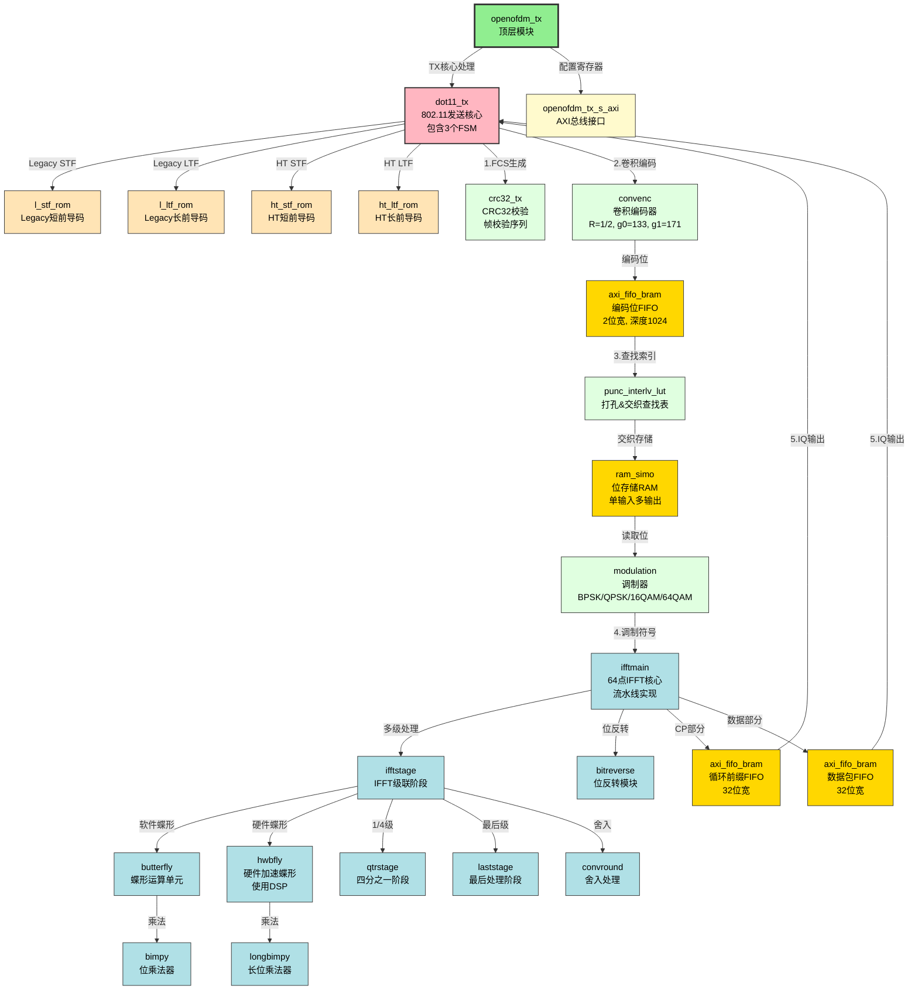

本文档展示了 openofdm_tx 项目中各个模块之间的调用关系和架构层次。

## 模块架构图

## 详细说明

### 1. 顶层模块 (openofdm_tx)

- **功能**: 整个OFDM发送器的顶层封装
    
- **接口**:
    
    - AXI Stream 接口用于数据输入
        
    - AXI Lite 接口用于配置
        
    - IQ样本输出
        

### 2. 核心模块 (dot11_tx)

包含三个主要的有限状态机（FSM）：

#### FSM1 - 数据收集状态机

- `S1_WAIT_PKT`: 等待数据包
    
- `S1_L_SIG`: 处理Legacy SIGNAL字段
    
- `S1_HT_SIG`: 处理HT SIGNAL字段
    
- `S1_DATA`: 处理数据字段
    
    - `S11_SERVICE`: 服务字段
        
    - `S11_PSDU_DATA`: PSDU数据
        
    - `S11_PSDU_CRC`: CRC字段
        
    - `S11_TAIL`: 尾部字段
        
    - `S11_PAD`: 填充字段
        

#### FSM2 - IQ样本生成状态机

- `S2_PUNC_INTERLV`: 打孔和交织
    
- `S2_PILOT_DC_SB`: 导频和直流处理
    
- `S2_MOD_IFFT_INPUT`: 调制和IFFT输入
    
- `S2_RESET`: 复位状态
    

#### FSM3 - IQ样本转发状态机

- `S3_WAIT_PKT`: 等待数据包
    
- `S3_L_STF`: 发送Legacy短前导码
    
- `S3_L_LTF`: 发送Legacy长前导码
    
- `S3_L_SIG`: 发送Legacy SIGNAL
    
- `S3_HT_SIG`: 发送HT SIGNAL
    
- `S3_HT_STF`: 发送HT短前导码
    
- `S3_HT_LTF`: 发送HT长前导码
    
- `S3_DATA`: 发送数据
    

### 3. 数据处理流程

1. **CRC32计算** (`crc32_tx`)
    
    - 对PSDU数据计算CRC32校验和
        
    - 生成帧校验序列(FCS)
        
2. **卷积编码** (`convenc`)
    
    - 码率: R = 1/2
        
    - 生成多项式: g0 = 133 (八进制), g1 = 171 (八进制)
        
    - 约束长度: K = 7
        
3. **打孔和交织** (`punc_interlv_lut`, `ram_simo`)
    
    - 根据速率进行比特打孔
        
    - 比特交织以对抗突发错误
        
4. **调制** (`modulation`)
    
    - BPSK: 1 bit/symbol
        
    - QPSK: 2 bits/symbol
        
    - 16-QAM: 4 bits/symbol
        
    - 64-QAM: 6 bits/symbol
        
5. **IFFT** (`ifftmain`)
    
    - 64点IFFT
        
    - 流水线结构
        
    - 使用DSP硬件加速
        
6. **输出缓冲** (`axi_fifo_bram`)
    
    - 循环前缀FIFO
        
    - 数据包FIFO
        

### 4. IFFT内部结构

IFFT采用流水线结构，包含多个处理阶段：

- **ifftstage**: 基本FFT级，使用Cooley-Tukey算法
    
- **butterfly**: 软件蝶形运算单元
    
- **hwbfly**: 硬件加速蝶形单元（使用DSP）
    
- **qtrstage**: 处理四分之一点
    
- **laststage**: 最后的处理阶段
    
- **bitreverse**: 输出位反转
    
- **bimpy/longbimpy**: 复数乘法器
    
- **convround**: 数据舍入
    

### 5. 支持的标准

- IEEE 802.11a/g (Legacy模式)
    
- IEEE 802.11n (HT模式)
    
- 支持的数据速率:
    
    - Legacy: 6, 9, 12, 18, 24, 36, 48, 54 Mbps
        
    - HT: 6.5, 13, 19.5, 26, 39, 52, 58.5, 65 Mbps
        

### 6. 关键参数

- OFDM符号周期: 4μs
    
- 循环前缀:
    
    - 长CP: 0.8μs (16 samples)
        
    - 短CP (HT): 0.4μs (8 samples)
        
- 子载波数: 52个数据子载波 + 4个导频子载波
    
- FFT大小: 64点
    
- 采样率: 20 MHz
    

## 模块文件列表

|                     |                   |               |
| ------------------- | ----------------- | ------------- |
| 文件名                 | 模块                | 功能            |
| openofdm_tx.v       | openofdm_tx       | 顶层模块          |
| openofdm_tx_s_axi.v | openofdm_tx_s_axi | AXI总线接口       |
| dot11_tx.v          | dot11_tx          | 802.11发送核心    |
| crc32_tx.v          | crc32_tx          | CRC32校验       |
| convenc.v           | convenc           | 卷积编码          |
| punc_interlv_lut.v  | punc_interlv_lut  | 打孔交织查找表       |
| modulation.v        | modulation        | 调制            |
| ifftmain.v          | ifftmain          | IFFT主模块       |
| ifftstage.v         | ifftstage         | IFFT级         |
| butterfly.v         | butterfly         | 蝶形运算          |
| hwbfly.v            | hwbfly            | 硬件蝶形          |
| qtrstage.v          | qtrstage          | 1/4阶段         |
| laststage.v         | laststage         | 最后阶段          |
| bitreverse.v        | bitreverse        | 位反转           |
| bimpy.v             | bimpy             | 位乘法器          |
| longbimpy.v         | longbimpy         | 长位乘法器         |
| convround.v         | convround         | 舍入            |
| axi_fifo_bram.v     | axi_fifo_bram     | AXI FIFO      |
| ram_simo.v          | ram_simo          | 单输入多输出RAM     |
| ram_2port.v         | ram_2port         | 双端口RAM        |
| l_stf_rom.v         | l_stf_rom         | Legacy短前导码ROM |
| l_ltf_rom.v         | l_ltf_rom         | Legacy长前导码ROM |
| ht_stf_rom.v        | ht_stf_rom        | HT短前导码ROM     |
| ht_ltf_rom.v        | ht_ltf_rom        | HT长前导码ROM     |