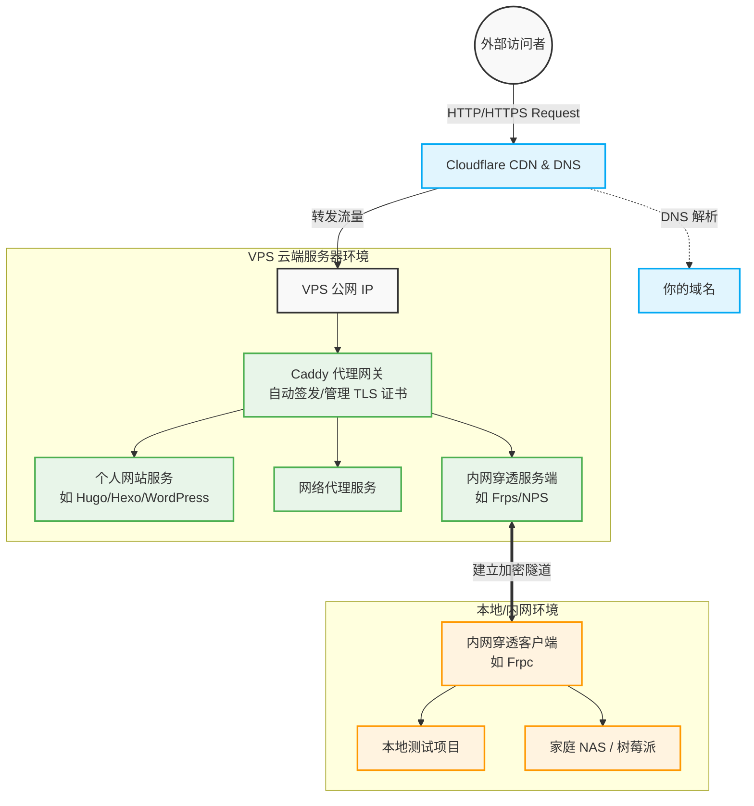
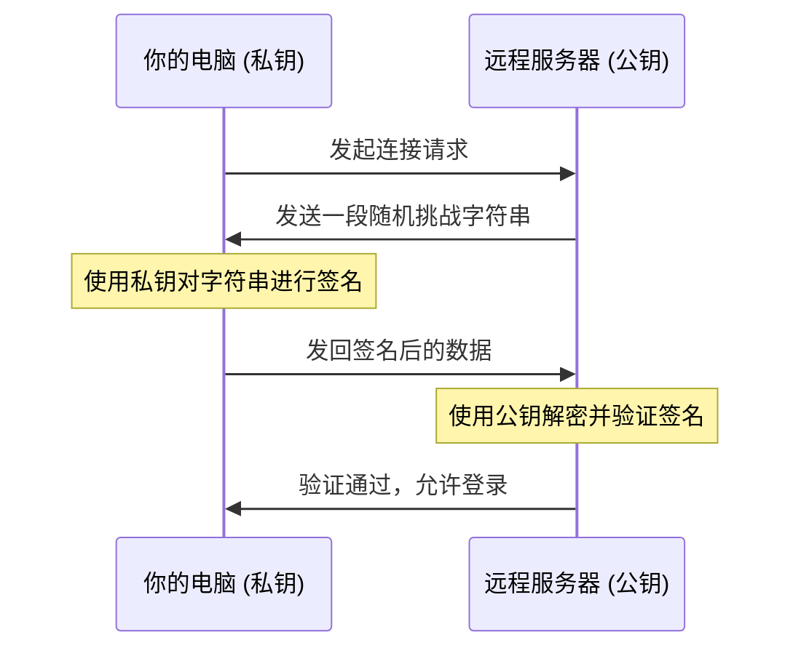
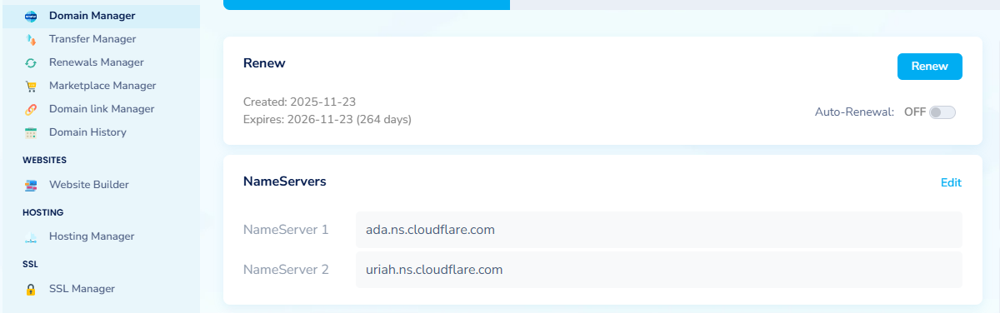

# 一、简介
## 1.引言

- 在学习Openwifi开源项目时，深入了解了TCP/IP模型的网络层和链路层/网络接口层的内容，但对于应用层和传输层的协议与功能没有深入了解。并且在搭建复现Openwifi项目时，发现在WSL Linux+windows Vivado的环境下无法复现该项目，还是需要一台Linux系统的电脑。并且我在windows docker-desktop上部署的Astrobot最好能在服务器上保持运行。
- 于是为了深入理解网络协议、满足多端开发需求，个人购置了一台Ubuntu系统的VPS，并在其上完成搭建网络服务，部署docker服务，复现Openwifi等任务。
- 本文档主要用于个人记录总结，内容仅供参考。
## 2.架构概览



# 二.、前期准备

## 1. VPS

- 国内的VPS选择较多，如腾讯云，阿里云，华为云等，易获取且价格较便宜，但可能有备案的要求。
- 国外的VPS购买可能受限于支付渠道，这里使用的是Vultr的服务器，地区选择的是日本，应该有更好的选择。
- VPS的硬件配置可按需选择，系统推荐**Ubuntu**/Debian，原因是：稳定、资源占用低、生态完善、文档丰富。
- 购买时记得勾选公网IPv4的选项。
- 在购买前可以先在本地生成一个SSH Key，其一般保存在~/.ssh/id_ed25519，在购买服务器的网站上可以直接贴上公钥。
```bash
ssh-keygen -t ed25519 -C "your_email"
```
- 建议下载一个SSH Client，这里用的是**Termius**，优点是可以跨平台同步，**SFTP 支持**， **端口转发** ，**端到端加密**
- 建议禁用密码登录，建议修改**SSH端口**，默认端口是22，减少被扫描的频率。



## 2. 域名

- 域名注册商推荐有 **NameSilo**, Cloudflare, Namecheap 等
- 刚购买的域名NameSilo会提供域名解析服务器，可以在此为域名添加Ａ记录和目标IP，即VPS的公网IP地址。
- A记录推荐在Cloudflare中进行配置。

# 三、 Cloudflare 接入与 DNS 解析

- 为什么选择cloudflare？**抗 DDoS 攻击** ，**隐藏真实 IP**，**节点丰富（CDN）** ，**免费 SSL** 等
- 在NameSilo中的Domain manager界面将域名的 Name Server (NS) 修改为 Cloudflare。如图：
    
- 在Cloudflare中配置DNS记录，A 记录指向VPS IP，C 记录指向域名。不带前缀的域名是主域名，子域名可设置为 www/cdn 等。
- 在 Cloudflare 的 DNS 设置面板中，每条记录旁边都有一个小云朵图标。它代表了 **Proxy（代理）状态**。
# 四、 Caddy 配置与自动化 HTTPS

## 1.  **Web 服务器软件选择**

- **核心功能**：建立连接，处理安全 (SSL/TLS)，解析请求，提供内容。
- **选择建议：** 作为个人开发者，更推荐Caddy，原因：配置简单，Caddy 会自动帮你申请、安装并续期证书（通过 Let's Encrypt），完全不需要人工干预，自动化HTTPS。
- **进阶选择：** Nginx，性能更好，但配置复杂，证书需手动申请。

## 2. 配置

- 安装：https://github.com/caddyserver/caddy
```bash
sudo apt install -y debian-keyring debian-archive-keyring apt-transport-https curl 
curl -1sLf 'https://dl.cloudsmith.io/public/caddy/stable/gpg.key' | sudo gpg --dearmor -o /usr/share/keyrings/caddy-stable-archive-keyring.gpg 
curl -1sLf 'https://dl.cloudsmith.io/public/caddy/stable/debian.deb.txt' | sudo tee /etc/apt/sources.list.d/caddy-stable.list 
chmod o+r /usr/share/keyrings/caddy-stable-archive-keyring.gpg 
chmod o+r /etc/apt/sources.list.d/caddy-stable.list 
sudo apt update 
sudo apt install caddy
```
- Caddyfile配置：全局配置，静态网站托管，反向代理，子域名处理
```json
{
  admin off      # 禁用 Caddy 的 API 管理接口，增强安全性，防止本地其他程序通过 API 修改配置。
  http_port 80   # 显式指定 HTTP 监听端口。
  https_port 443 # 显式指定 HTTPS 监听端口。
}
```

```json
example.com {
    root * /var/www/html
    file_server
}
example.com {
    reverse_proxy localhost:8080
}
blog.example.com { 
reverse_proxy localhost:8081 
}
```
- 运行管理：
	- 启动/重启：`sudo systemctl restart caddy`
	- 停止：`sudo systemctl stop caddy`
	- 查看状态：`sudo systemctl status caddy`
	- 热加载配置：`sudo systemctl reload caddy`

- Caddy在满足以下条件时，会自动配置SSL：
	- 域名的 A 记录指向 VPS IP。
	- VPS 的 80/443 端口是开放的。

- 注意：**Cloudflare 冲突**，如果你开启了 Cloudflare 的“橙色云朵”（代理模式），建议在 Cloudflare 后台将 SSL 设置为 **"Full (strict)"**，以配合 Caddy 的自动证书。

# 五、核心服务部署

## 1. 搭建个人网站

- 这里推荐使用基于 [Astro](https://astro.build/) 开发的静态博客模板，简洁美观，且易于上手。 https://github.com/saicaca/fuwari
- 本人在此基础上进行的修改： https://github.com/youholic/fuwari
- 关键命令：`pnpm dev`本地端口预览；`pnpm build` 构建网站至 `./dist/`
- 将 `./dist/`中的内容复制到 Caddy配置中的路径`* /var/www/html`即可完成网页部署。

## 2. 配置网络代理服务

- sing-box 脚本可一键配置Hysteria2 / TUIC，无需Caddy。
- WebSocket (WS) + TLS，需用Caddy配置网站和反向代理。
- gRPC，需要使用 反向代理的 `h2c` 模式（即不带 TLS 的 HTTP/2）

## 3. 内网穿透

- 应用场景： 随时随地访问家中的 NAS、远程调试本地代码、暴露本地测试接口。
- 在 VPS 上安装 FRP 服务端 (`frps`)
```bash
# 下载
wget https://github.com/fatedier/frp/releases/download/v0.54.0/frp_0.54.0_linux_amd64.tar.gz

# 解压
tar -zxvf frp_0.54.0_linux_amd64.tar.gz

# 改个短名字，方便操作
mv frp_0.54.0_linux_amd64 frp

# 进入目录
cd frp

```
- 配置服务端 (`frps.toml`)
我们需要告诉 FRP：“请在 7000 端口等待我的电脑连接，并在 8080 端口接收 Caddy 发来的数据。”
```bash
cat > frps.toml <<EOF
# frps.toml
bindPort = 7000         # 隧道通讯端口
vhostHTTPPort = 8080    # HTTP 接收端口 (对应 Caddy 的 reverse_proxy)
auth.token = "12345678" # 通讯密码 (你也改个复杂的)
EOF
```
- 启动服务端
```bash
./frps -c frps.toml
```
**✅ 成功标志：** 如果你看到类似 `frps started successfully` 的字样，说明 VPS 端准备就绪了！**请保持这个窗口不要关。**
- 在 Windows 上安装 FRP 客户端 (`frpc`)
- 配置客户端 (`frpc.toml`)
```bash
# frpc.toml
serverAddr = ""  # 你的 VPS IP 地址
serverPort = 7000             # 对应服务端的 bindPort
auth.token = "12345678"       # 必须和服务端密码一致

[proxies](javascript:void(0))
name = "服务"
type = "http"
localIP = "127.0.0.1"
localPort = 5000              # 本地服务监听的端口
customDomains = [""]          # 配置反向代理的域名
```
- 启动客户端
```bash
.\frpc.exe -c frpc.toml
```
**✅ 成功标志：**
你会看到一行蓝字/白字：`[wechat-bot] start proxy success`。
